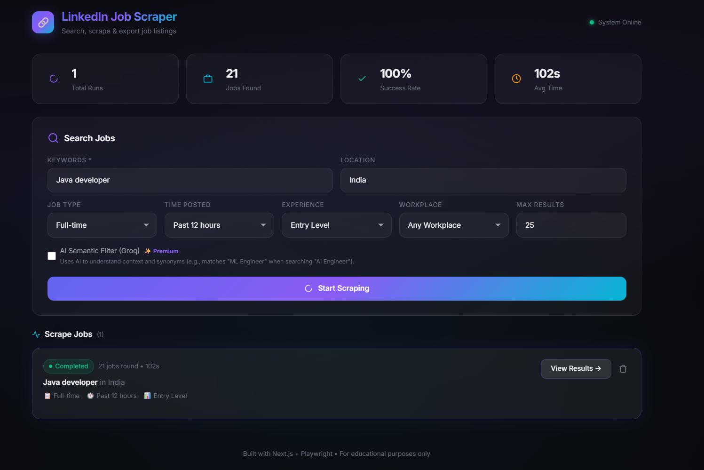
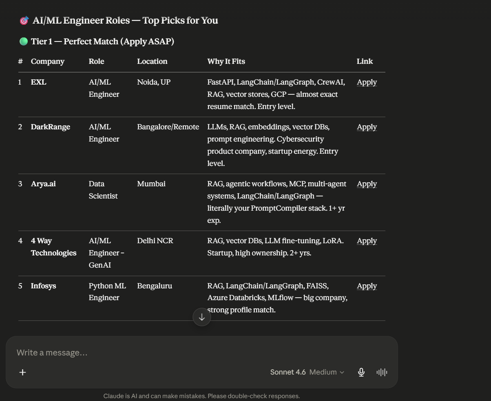
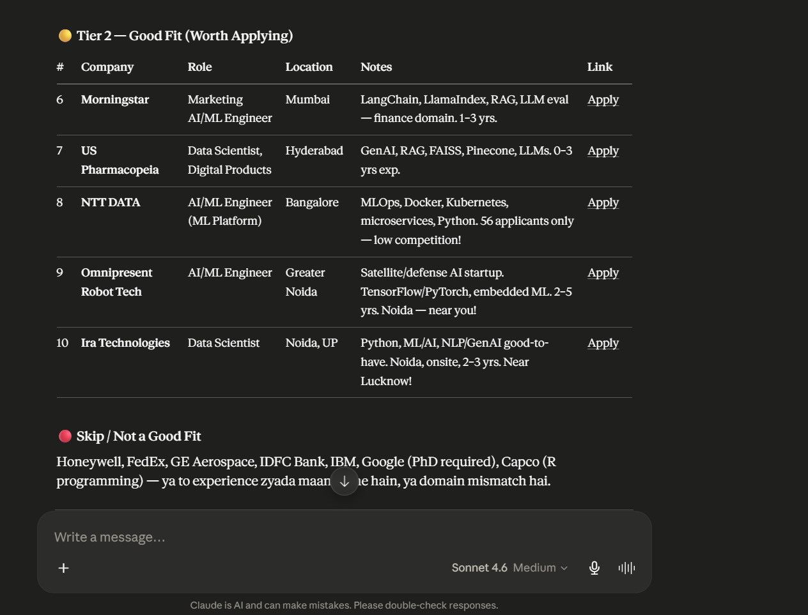

# LinkedIn Scraper MCP Server

An automated, intelligent LinkedIn Job Scraper that runs as a Model Context Protocol (MCP) server. This allows AI assistants (like Claude) to actively search, filter, and extract job listings from LinkedIn using an automated headless browser.

## 🚀 Hosted Server URL

If you want to connect your AI directly to the hosted remote server, use this SSE endpoint:

> **👉 https://anjanii-linkedin-job-scraper.hf.space/mcp**

---

## ✨ Features
- **Playwright Automation**: Safely navigates LinkedIn and loads dynamic content using a headless Chromium browser.
- **Semantic AI Filtering**: Integrates with Groq (`llama-3.3-70b-versatile`) to semantically filter irrelevant job titles, enforcing strict requirements (e.g. keeping "Fresher" while rejecting "Senior" level).
- **Deduplication**: Automatically cleans and removes duplicate job postings.
- **Rich Job Details**: Extracts deep metadata including Salary, Employment Type, Seniority, Applicant count, and Required Skills.
- **Dual Connection Modes**: Supports both **SSE** (for remote web clients) and **Stdio** (for the local Claude Desktop app).
- **Dual-Purpose Architecture**: Hosts both the MCP Server (at `/mcp`) and a **Next.js Web Dashboard** (at `/`) simultaneously on port 7860.

---

## 🖥️ Web Dashboard (UI)





Because this project uses a custom Next.js server architecture, if you visit your live server's root URL:
**👉 [https://anjanii-linkedin-job-scraper.hf.space](https://anjanii-linkedin-job-scraper.hf.space)**
(or `http://localhost:7860` locally), you will see the Next.js web interface! You can use this to build a visual frontend dashboard to track jobs alongside your Claude integration.

---

## 🤔 Why use this instead of LinkedIn directly?

If you've ever searched for an entry-level or specific role on LinkedIn, you know the pain:
1. **Irrelevant "Promoted" Jobs**: LinkedIn aggressively pushes promoted jobs that often have nothing to do with your search.
2. **Broken Seniority Filters**: You search for "Intern" or "Junior", but half the results are for "Senior Manager" because the company mentioned "Junior" somewhere deep in the description. Our **Groq LLM Semantic Filter** fixes this by physically rejecting listings that don't match your true intent.
3. **Information Overload**: To find the salary, required skills, or applicant count, you normally have to open 50 different tabs. This scraper pulls all of that deep metadata out for you at once.
4. **AI-Ready Format**: Because the data is returned as structured JSON directly to Claude, Claude can instantly read all 25+ jobs, summarize the market, pick the best matches for your resume, or even start drafting cover letters for them immediately!

---

## 💻 Connecting to Claude Desktop (Local)

To run this tool locally on your own machine alongside the Claude Desktop App:

1. Clone this repository.
2. Install dependencies and the browser:
   ```bash
   npm install
   npx playwright install --with-deps chromium
   ```
3. Create a `.env.local` file in the root directory and add your Groq API key:
   ```env
   GROQ_API_KEY=gsk_your_groq_api_key_here
   ```
4. Add the following to your Claude Desktop config file (`%APPDATA%\Claude\claude_desktop_config.json`):
   ```json
   {
     "mcpServers": {
       "linkedin-scraper": {
         "command": "npx",
         "args": [
           "tsx",
           "/absolute/path/to/repository/mcp-claude.ts"
         ]
       }
     }
   }
   ```
5. Restart the Claude Desktop app.

---

## 🌉 Connecting Claude Desktop to Hugging Face (Remote Bridge)

If you want to use the **Claude Desktop App** but run the actual scraper backend in the cloud on **Hugging Face Spaces** (so it doesn't use your computer's CPU or require local Playwright installation), you can use the `mcp-remote` bridge!

Add the following to your Claude Desktop config file (`%APPDATA%\Claude\claude_desktop_config.json` on Windows or `~/Library/Application Support/Claude/claude_desktop_config.json` on Mac):
```json
{
  "mcpServers": {
    "linkedin-scraper-remote": {
      "command": "npx",
      "args": [
        "-y",
        "mcp-remote",
        "https://anjanii-linkedin-job-scraper.hf.space/mcp"
      ]
    }
  }
}
```
This automatically bridges the cloud Server-Sent Events (SSE) stream into a local format that your Claude App can read!

---

## 🌐 Connecting to a Web MCP Client (Remote)

If you are hosting this on Hugging Face Spaces (or running the SSE server locally):

1. Open your Web AI interface (like Claude for Enterprise, Cursor, etc).
2. Add a new **Custom MCP Connector** or Integration.
3. Select **SSE (Server-Sent Events)** as the connection type.
4. Enter your live Hugging Face URL:
   > **`https://anjanii-linkedin-job-scraper.hf.space/mcp`**
   *(Or `http://localhost:7860/mcp` if testing locally).*

---

## ☁️ Deployment

A `Dockerfile` is included specifically for deploying this project to **Hugging Face Spaces** (Docker tier). 
Simply upload the repository files to a new Docker Space, add your `GROQ_API_KEY` to the Space Settings -> Variables and secrets, and Hugging Face will automatically build the environment and host the MCP server for you.
itory files to a new Docker Space, add your `GROQ_API_KEY` to the Space Settings -> Variables and secrets, and Hugging Face will automatically build the environment and host the MCP server for you.
